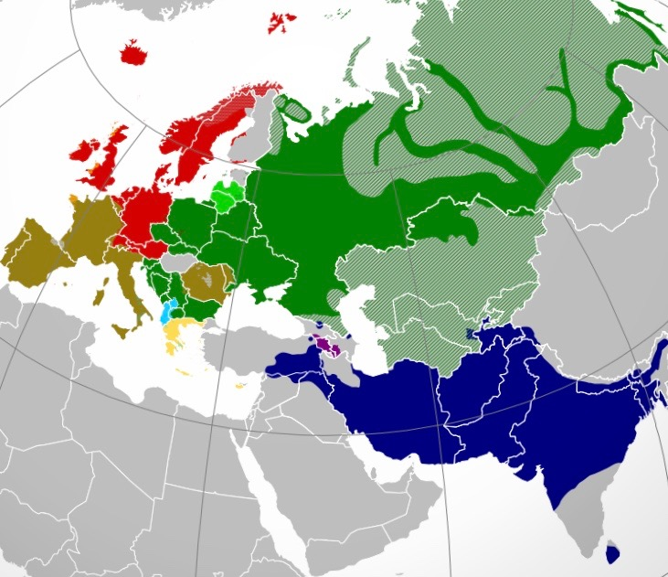

Before we start this topic, we will first need to understand that all the groups that considers themselves to be **Aryans** have similar beliefs, cultures as well as Gods. The oldest Indo-Aryan God we know is *Dwas\* Pithar*  which translates to **Sky Father.**

&#x20;This article understands how The Roman Polytheism and The Vedic Polytheism **is** by taking into account of their gods. First let us look at the common gods these beliefs share:

* Jupiter = Indra
* Apollo = Vishnu, also Surya (sun God), who is an aspect of Vishnu
* Pluto = Yama
* Mars = Kartikeya (also known as Murugan)
* Juno = Lakshmi

Now these names might not look anything similar, but if you look into the characteristics of these gods, then you will find out their similarities.

NOTE: I will update the blog once I find more resources for this!
